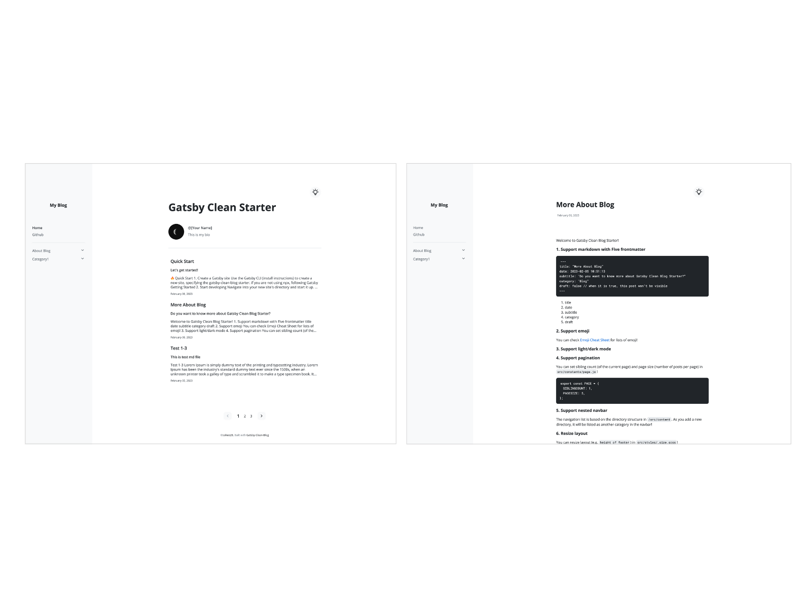
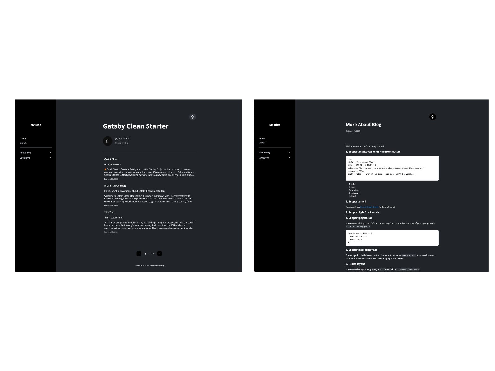

## :eyes: Check this out as well!
There is an updated version of this blog template : [Gatsby-Image-Blog-Starter](https://github.com/soheee-bae/Gatsby-Image-Blog-Starter)

<br/>

## 🚀 Demo

https://gatsbycleanblogstarterkit.gatsbyjs.io/

<br/>

## :fire: Quick Start

### 1. Create a Gatsby site

Use the Gatsby CLI ([install instructions](https://www.gatsbyjs.com/docs/tutorial/part-0/#gatsby-cli)) to create a new site, specifying the gatsby-clean-blog starter.

```
npx gatsby new gatsby-clean-blog-starter https://github.com/soheee-bae/Gatsby-Clean-Blog-Starter
```

> if you are not using `npx`, following [Gatsby Getting Started](https://www.gatsbyjs.com/docs/quick-start/)

```
npm install -g gatsby-cli
gatsby new gatsby-clean-blog-starter https://github.com/soheee-bae/Gatsby-Clean-Blog-Starter
```

### 2. Start developing

Navigate into your new site's directory and start it up.

```
cd gatsby-clean-blog-starter/
gatsby develop
```

### 3. Open the source code and start editing!

Your site is now running at `http://localhost:8000`!

Note: You'll also see a second link: `http://localhost:8000/___graphql`. This is a tool you can use to experiment with querying your data. Learn more about using this tool in the [Gatsby Tutorial](https://www.gatsbyjs.com/docs/tutorial/part-4/#use-graphiql-to-explore-the-data-layer-and-write-graphql-queries).

### 4. Add your content

You can write contents to blog in `/content` directory.
As you add a new directory, it will be listed as new category in the navbar!

### 5. Fix meta data

You can fix meta data in `/gatsby-metaconfig.js` file.

## :yellow_heart: Customize

### :computer: Gatsby config

```
root
├── gatsby-config.js
├── gatsby-metaconfig.js
└── gatsby-node.js
```

### :file_folder: Folder structure

```
src
├── components // components with styling
├── constants // collections of string global variables
├── layout // layout for home and post
├── pages // 404 page, about page, home page
├── hooks
├── styles
├── utils
└── templates
    └── blog-post.js // blog template
```

### :art: Style

You can customize color, font, breakpoints and height / width of layout in `src/styles` directory.

```
src/styles
├── _breakpoints.scss
├── _colors.scss
├── _mixins.scss
├── _size.scss
└── _typography.scss
```

### :mag: Tip (Things you can customize!)

- Profile image : replace file in `/assets/images/moon.jpeg`.
- Pagination : set sibling count (of the current page) and page size (number of posts per page) in `src/constants/page.js`.
- Resize layout : You can resize layout (e.g. `height of footer`) in `src/styles/_size.scss`.
- Change color : All colors that have been used in this blog are in `src/styles/_color.scss`. You can simply change hex code color from `src/styles/_color.scss`!
- Post thumbnail : You can display or hide (`title, subtitle, date, content`) by setting the option from `src/constants/contentItem.js`!
